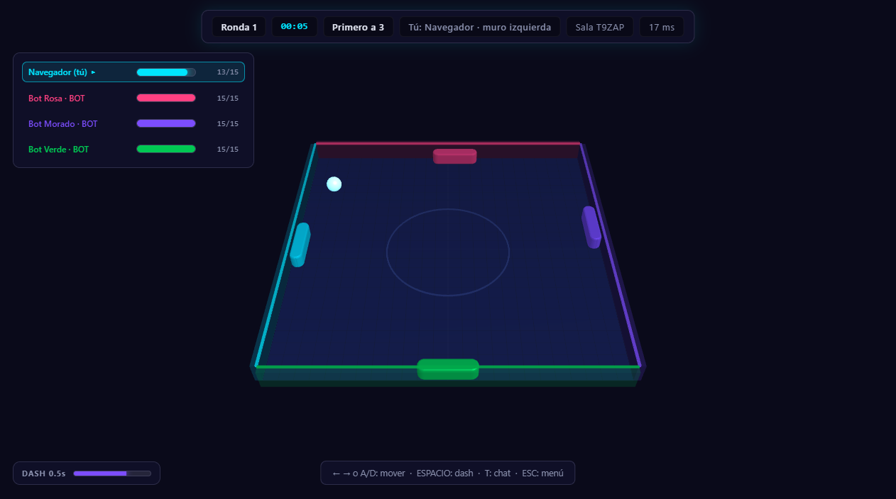

# 🎮 Crash Ball Arena

Juego arcade multijugador: una arena cuadrada donde **cada jugador defiende un
muro**. Mueve tu pala para interceptar la pelota; si pasa, pierdes un punto de
vida. El último en pie gana la ronda, y el primero en ganar las rondas
elegidas gana la partida.

Un solo ejecutable sirve el cliente web **y** hospeda las partidas, así que no
hace falta instalar nada más. Se juega online: crea una sala, comparte el código
de 5 letras y el resto entra por él.



---

## Arranque rápido

```bash
cmake -S . -B build
cmake --build build --config Release
./build/Release/server.exe        # Windows
./build/server                    # Linux / macOS
```

Abre **<http://localhost:8080/>**: verás el menú. Elige *Jugar rápido* para
entrar solo (los asientos libres los ocupan bots) o *Crear sala* para tener una
partida con tu código.

```bash
./build/Release/server.exe 9000 expert    # otro puerto, bots más duros
```

En Windows también hay un script que hace configurar + compilar + arrancar de
una vez, usando únicamente CMake:

```bat
Server\build.bat              REM puerto 8080, dificultad hard
Server\build.bat 9000 expert  REM puerto y dificultad
```

| Argumento | Por defecto | Descripción |
|-----------|-------------|-------------|
| `puerto` | `8080` | Puerto HTTP + WebSocket |
| `dificultad` | `hard` | `easy` \| `medium` \| `hard` \| `expert` |
| `rondas` | `3` | Rondas para ganar la partida (1–9) |
| `--selftest` | — | Comprueba el handshake, SHA-1, códigos de sala y saneo de nombres, y sale |

### Atajos con GNU Make (opcional)

El `Makefile` es **solo un envoltorio cómodo** sobre los comandos de CMake de
arriba, para no escribirlos cada vez. No es necesario para compilar ni jugar.

Ojo: **`make` no es `cmake`**. `cmake` es el generador del sistema de
compilación y en Windows produce un proyecto de Visual Studio que se compila
con MSBuild; `make` es otra herramienta distinta. El `Makefile` necesita **GNU
Make** instalado (`make` o `gmake`), que no viene ni con Windows ni con Visual
Studio. Si no lo tienes, usa `cmake --build` o `build.bat`.

```bash
make build     # configura y compila
make run       # compila y arranca
make test      # compila y ejecuta el test de protocolo
make help      # todas las opciones
```

---

## Cómo se juega online

### El menú

| Acción | Qué hace |
|--------|----------|
| **Jugar rápido** | Entra en la partida abierta de siempre, que ya está corriendo con bots. Sin listas ni esperas. |
| **Crear sala** | Pones título, rondas, número de plazas y dificultad de bots. Eres el anfitrión: tú decides cuándo empieza. |
| **Unirse con código** | Escribes las 5 letras y entras. |
| **Salas abiertas** | Listado en vivo: quién está dentro, cuántas plazas quedan, si ya se está jugando. Se actualiza solo. |

### El vestíbulo

Antes de empezar se ven los jugadores, quién es el anfitrión y quién está
listo. Mientras nadie ha iniciado, el anfitrión puede cambiar las reglas. El
botón **Iniciar partida** es suyo: hasta que lo pulse, nadie juega, así que
nadie entra a medias en una partida que ya ha empezado.

El código de la sala se toca para copiarlo, y también se puede copiar la
URL: si alguien abre el enlace y pega el código, entra.

### Controles

| Tecla | Acción |
|-------|--------|
| `←` `→` o `A` `D` | Deslizar la pala por tu muro |
| `Espacio` / `Enter` | **Dash** — pala más larga y golpe 3× más fuerte |
| `R` | Reiniciar la partida (cuando ya terminó) |
| `T` | Chat |
| `Esc` | Menú de la partida (volver al vestíbulo, salir) |

En móvil aparecen botones táctiles grandes abajo.

---

## Reglas

- **Arena** de 300×300 unidades con un muro por asiento. Al empezar hay una
  pelota; cada 18 s aparece otra hasta un máximo de 4.
- **Salvar la pelota**: si tu pala está delante, la desvías. El ángulo de salida
  depende de dónde la golpees (centro = recto, bordes = angulado) y la pelota se
  acelera un 5 % por golpe, hasta 1500 u/s.
- **Conceder**: si la pelota toca tu muro fuera de la pala, pierdes 1 de 15
  puntos de vida y la pelota vuelve al centro a velocidad base.
- **Dash**: 0,25 s de pala extendida (×1,7) y multiplicador de golpe ×3, con
  0,45 s de recarga.
- **Eliminación**: a 0 de vida quedas fuera de la ronda.
- **Rondas**: gana el último con vida. Primero en las rondas elegidas gana la
  partida.

### Asientos y muros

| Asiento | Muro | Eje de deslizamiento | Color |
|---------|------|----------------------|-------|
| 0 | izquierda | y | `#00e5ff` cian |
| 1 | arriba | x | `#ff4081` rosa |
| 2 | derecha | y | `#7c4dff` morado |
| 3 | abajo | x | `#00c853` verde |

Los muros que nadie ocupa los defienden bots. Una sala admite hasta 4 humanos
(el límite son los muros, no el número de salas): cuando están todos, el
servidor rechaza la conexión explicando el motivo.

---

## Arquitectura

```
Navegador                          Servidor (C++17, un solo proceso)
┌───────────────────────┐          ┌──────────────────────────────────────┐
│ js/ui.js   · DOM      │          │ accept loop (hilo principal)         │
│ js/net.js  · socket   │◄───┐     │   ├─ HTTP  → public/  (keep-alive)   │
│ js/menu.js · menú/lobby│    │     │   └─ WebSocket → ROOM_*/INPUT/DASH  │
│ js/arena.js· Three.js │    │     │                                      │
│ js/main.js · router   │    │     │ 1 hilo por conexión (solo lectura)  │
└───────────────────────┘    │     │                                      │
        HTTP + WebSocket     └─────┤ 1 hilo de juego @ 60 Hz exacto       │
        mismo puerto               │   por sala: update() → STATE → flush │
                                    └──────────────────────────────────────┘
```

**El servidor es la única autoridad.** El cliente no simula física: solo
interpola hacia las posiciones que recibe, así que no puede desincronizarse.

### Ficheros

```
space-ball/
├── Server/
│   ├── server.cpp        # red, salas, bucle de juego, arranque, --selftest
│   ├── game_state.h/.cpp # simulación de la arena (autoritativa)
│   ├── room.h            # sala: código, anfitrión, roster, ajustes, fase
│   ├── protocol.h        # JSON de entrada y salida, en un solo sitio
│   ├── websocket.h       # WebSocket RFC 6455 + SHA-1/base64 del handshake
│   ├── net.h             # primitivas de socket (Winsock / BSD)
│   ├── json.h            # lector JSON mínimo
│   ├── http_files.h      # servidor de ficheros estáticos
│   ├── build.bat         # script de compilación para Windows
│   ├── ai.h/.cpp         # [sin usar] no está en la build
│   └── network.h         # [sin usar] no está en la build
├── public/
│   ├── index.html        # menú, vestíbulo, HUD, chat y overlays
│   ├── styles.css        # estética neón
│   ├── favicon.png
│   ├── js/               # cliente, sin build step (ver más abajo)
│   └── vendor/three.min.js  # Three.js r128 local (sin CDN)
├── tools/
│   ├── smoke-test.mjs    # protocolo, multijugador, salas y ciclo de partida
│   └── browser-test.mjs  # menú y partida en Chrome headless real
├── legacy/               # copia del árbol original, antes de las correcciones
├── CMakeLists.txt
└── Makefile              # atajos opcionales (requiere GNU Make, no CMake)
```

`Server/ai.h`, `Server/ai.cpp` y `Server/network.h` están **fuera de la build**:
implementaban un protocolo binario y una clase `BotBrain` que nada usaba. Se
conservan con un aviso en la cabecera y se pueden borrar.

---

## Jugar por Internet

El servidor escucha en **todas las interfaces**, así que en una red local solo
basta con pasar la IP: `http://192.168.1.50:8080`.

Para jugar desde fuera hay que poner un proxy inverso delante con TLS. El
servidor **no** implementa TLS (sería una dependencia enorme para un ejecutable
de un archivo), pero el cliente negocia el esquema solo, así que funciona sin
cambiar una línea:

```nginx
server {
    listen 443 ssl;
    server_name crashball.example.com;

    ssl_certificate     /etc/letsencrypt/live/crashball.example.com/fullchain.pem;
    ssl_certificate_key /etc/letsencrypt/live/crashball.example.com/privkey.pem;

    location / {
        proxy_pass http://127.0.0.1:8080;
        proxy_http_version 1.1;
        # Sin esto el WebSocket no se establece y el juego se queda en "conectando".
        proxy_set_header Upgrade    $http_upgrade;
        proxy_set_header Connection "upgrade";
        proxy_set_header Host       $host;

        # Las instantáneas son pequeñas y seguidas; sin buffer intermédiaire
        # llegan cuando salen.
        proxy_buffering off;
    }
}
```

Con eso los jugadores entran por `https://crashball.example.com`, el proxy
reenvía el WebSocket al proceso de C++ y el cliente usa `wss://` automáticamente
porque la página va por HTTPS.

Si expones el puerto directamente (sin proxy), ojo a dos cosas: hay que abrir el
puerto en el router (redirección de puertos) y la partida viaja en claro. Para una
partida entre amigos en una red doméstica vale; para Internet abierto, proxy con
TLS.

---

## Protocolo

WebSocket en el mismo puerto que el HTTP. Todos los mensajes son JSON en texto.

**Cliente → servidor**

```jsonc
// Partida rápida (partida abierta, arranca sola)
{"type":"QUICK","name":"Ana","sessionId":"9f2c…"}
{"type":"JOIN","name":"Ana"}                    // alias antiguo de QUICK

// Vestíbulo
{"type":"ROOMS"}                               // listado de salas abiertas
{"type":"ROOM_CREATE","name":"Ana","title":"Sala de Ana",
 "roundsToWin":3,"difficulty":"medium","humanSlots":2}
{"type":"ROOM_JOIN","code":"X8TUV","name":"Beto","sessionId":"…"}
{"type":"ROOM_LEAVE"}
{"type":"ROOM_CONFIG","roundsToWin":5}          // solo anfitrión, solo en vestíbulo
{"type":"ROOM_START"}                          // solo anfitrión
{"type":"ROOM_LOBBY"}                          // volver al vestíbulo
{"type":"READY","ready":true}
{"type":"KICK","id":42}                        // solo anfitrión
{"type":"CHAT","text":"hola"}
{"type":"RESUME","code":"X8TUV","sessionId":"…"} // recuperar sesión

// Partida
{"type":"INPUT","move":-1}     // -1 | 0 | 1 — estado mantenido, no un pulso
{"type":"DASH"}
{"type":"RESTART"}
{"type":"PING","t":1234}
```

**Servidor → cliente**

```jsonc
{"type":"HELLO","id":12,"sessionId":"9f2c…"}

{"type":"ROOM","code":"X8TUV","title":"Sala de Ana","phase":"lobby",
 "isHost":true,"hostId":12,"quick":false,
 "config":{"roundsToWin":3,"difficulty":"medium","humanSlots":2},
 "players":[{"id":12,"session":"9f2c…","name":"Ana","host":true,"you":true,
             "ready":false,"online":true,"ai":false,"seat":-1}],
 "botSeats":4}
```

`phase` es `lobby` | `playing` | `finished`. La vista del vestíbulo se manda
**personalizada** para cada jugador (quién es el anfitrión, quién eres tú), y
`players` incluye a los que están desconectados mientras su muro siga reservado.

```jsonc
{"type":"ROOMS","rooms":[{"code":"X8TUV","title":"Sala de Ana","phase":"playing",
 "players":2,"maxPlayers":4,"roundsToWin":3,"difficulty":"medium"}]}
```

```jsonc
{"type":"WELCOME","seat":0,"name":"Ana","maxPlayers":4,"wall":"left",
 "roundsToWin":3,"startHealth":15,"room":"","sessionId":"9f2c…","phase":"playing"}
{"type":"SEATED","seat":2,"name":"Ana","wall":"top","room":"X8TUV"}
```

```jsonc
{"type":"STATE","room":"X8TUV","seq":1024,
 "round":{"phase":"playing","roundNumber":1,"gameTime":12345,
          "roundOver":false,"matchOver":false,"winner":-1,"matchWinner":-1,
          "countdown":0,"roundsToWin":3,"startHealth":15},
 "players":[{"seat":0,"name":"Ana","bot":false,"present":true,"alive":true,
             "hp":15,"roundsWon":0,"x":-144.0,"y":-30.0,
             "wall":"left","dashing":false}],
 "balls":[{"x":0.0,"y":0.0,"vx":120.0,"vy":-80.0}]}
```

`seq` es monótono por sala: un cliente que recibe algo desordenado lo descarta.
Unidades: `round.gameTime` va en **milisegundos**; `round.countdown` va en
**segundos** (tiempo restante de la pantalla de resultado).

```jsonc
{"type":"ERROR","code":"ROOM_FULL","message":"La sala esta llena"}
{"type":"REJECT","reason":"…"}                  // respuesta antigua a JOIN
{"type":"KICKED","reason":"El anfitrión te expulsó de la sala"}
{"type":"NOTICE","text":"Saliste de la sala"}
{"type":"CHAT","from":"Beto","text":"hola"}
{"type":"PONG","t":1234}
```

Códigos de `ERROR`: `ROOM_NOT_FOUND`, `ROOM_FULL`, `NOT_HOST`, `IN_PROGRESS`,
`SERVER_FULL`.

Cuando la partida queda decidida (`matchOver: true`), el motor se detiene y
espera a un `RESTART` o a un `ROOM_START` del anfitrión.

---

## Detalles que hacen que se juegue bien online

Son las razones de cada decisión rara del código. Si algo parece absurdo, suele
estar aquí la explicación.

**El bucle de juego nunca escribe en un socket.** Cada conexión tiene una cola de
salida; el bucle empuja lo que el kernel acepte y reintenta el resto en el
siguiente tick. Un jugador con el portátil en reposo pierde sus propios frames, no
la partida de los demás. Antes, un solo socket lento congelaba la arena entera
durante los 2 s de timeout de envío.

**Paso fijo de 1/60 s.** Con un `dt` variable la física depende del ritmo de
cuadros: el mismo golpe rebotaba distinto en un máquina cargada. Ahora el reloj
acumula deadlines en vez de dormir "16 ms", así que no deriva. En Windows hace
falta `timeBeginPeriod(1)` (`winmm`): sin eso el sistema duerme en saltos de
15,6 ms y el bucle corre a ~33 Hz, es decir, **la partida al 50 % de velocidad**.

**Reconexión con sesión.** El navegador genera un `sessionId` y lo manda en cada
entrada; el servidor lo recuerda 2 minutos. Si te caes, el muro lo juega la IA
con tu vida y tu marcador, y al volver te lo devuelve. Quien no vuelve libera el
muro a los 2 min.

**Keepalive.** Ping cada 10 s y cierre a los 35 s sin tráfico: un socket zombi
(ordenador apagado, wifi que se cayó) no bloquea un asiento indefinidamente.

**Espectadores a 10 Hz.** Quien no tiene muro no necesita 60 instantáneas por
segundo. Los jugadores sí, siempre.

**Interpolación con retraso.** El cliente guarda las últimas instantáneas y dibuja
el instante *hace 100 ms*, interpolando entre las dos muestras que lo rodean.
Con la tasa de red justa eso quita los tirones sin añadir latencia perceptible.

**Reconexión con espera creciente** y reconsideration inmediata al volver a la
pestaña, para no gastar la batería del móvil en segundo plano.

---

## Verificación

Dos suites, ambas sin dependencias npm (`node:test` no hace falta: usan el
`WebSocket` integrado de Node 22+).

```bash
# Todo: HTTP, handshake, entrada, multijugador, salas, tope de 4 humanos,
# ciclo de ronda/partida y RESTART.
node tools/smoke-test.mjs 8080

# Solo salas (segundos en vez de minutos: lo cómodo mientras se tocan salas)
node tools/smoke-test.mjs 8080 --rooms

# Navegador real: menú, creación de sala, HUD en vivo, teclado, errores de consola
node tools/browser-test.mjs http://127.0.0.1:8080/
```

`browser-test.mjs` lanza Chrome headless por el protocolo DevTools
(`CHROME_PATH` para indicar otro binario) y guarda una captura para revisarla a
ojo.

El smoke test tiene dos fases muy distintas en duración: la de salas y protocolo
tarda unos segundos, y la de **ciclo de partida** puede tardar minutos porque las
rondas son defensivas. Para ejercitar el final de partida y el `RESTART` en
pocos segundos, arranca el servidor con una sola ronda ganadora y bots fáciles:

```bash
./build/Release/server.exe 8083 easy 1
node tools/smoke-test.mjs 8083
```

---

## Requisitos

- **Compilar**: CMake 3.14+ y un compilador C++17 (MSVC, g++ o clang++). En
  Windows solo hace falta Winsock y `winmm`, que vienen con el sistema. **No
  hace falta `make`**: en Windows CMake genera un proyecto de Visual Studio y lo
  compila con MSBuild.
- **Jugar**: un navegador con WebGL. Three.js va vendorizado; no se descarga
  nada de internet.
- **Tests**: Node.js 22+ (por el `WebSocket` global).
- **Opcional**: GNU Make, solo si quieres los atajos del `Makefile`.

---

## Notas de implementación

- **WebSocket real (RFC 6455)**: handshake con SHA-1 + base64, tramas con
  máscara, longitudes de 16/64 bits, fragmentación, ping/pong y close. El
  `SHA-1` está verificado contra los vectores de FIPS 180-1 con
  `server.exe --selftest`: un `Sec-WebSocket-Accept` incorrecto hace que
  **todos** los clientes rechacen la conexión, y ese fallo es muy difícil de
  ver desde el navegador.
- **Un hilo por conexión**, solo para leer. Las escrituras las lleva el hilo de
  juego, así que no hace falta ni un hilo más ni bloquearse entre sí.
- **El motor está protegido por un mutex por sala** y las secciones críticas son
  mínimas. `lobbyMutex_` nunca se mantiene mientras se toma el motor, así que no
  hay un orden de bloqueos que recordar.
- Las conexiones HTTP de tipo keep-alive se cierran tras 15 s de inactividad;
  un WebSocket ya establecido no tiene timeout de lectura.
- La pelota avanza en subpasos para que no atraviese un muro a alta velocidad.